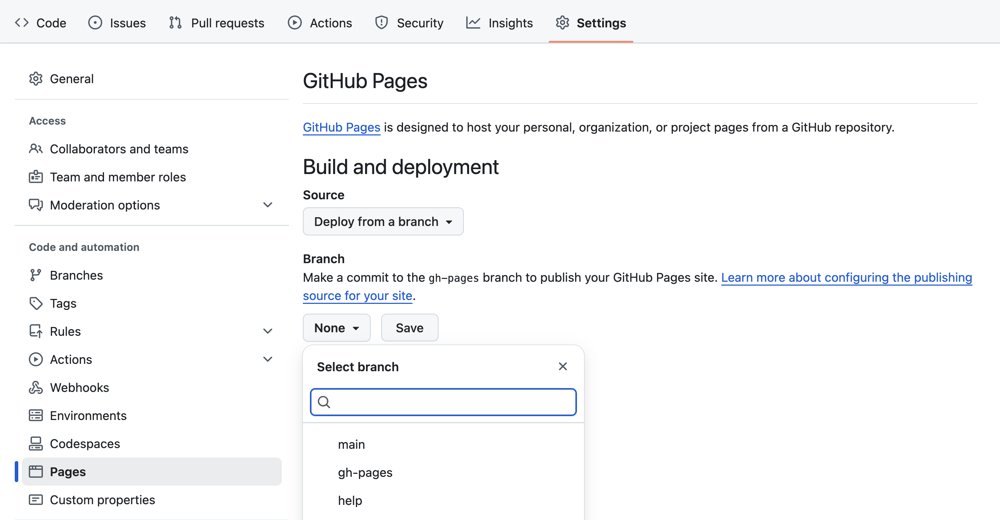

# Material for MkDocs Imperial Template

This repository can be used as a template for building beautiful
pages with [Material for MkDocs](https://squidfunk.github.io/mkdocs-material/) and is the main resource for ECRI's [Publishing Software Projects for Open Science](https://www.imperial.ac.uk/students/academic-support/graduate-school/professional-development/doctoral-students/research-computing-data-science/courses/open-science/) course.

After you've create your new repository from the template, build your site by following along with the [Material for MkDocs documentation](https://squidfunk.github.io/mkdocs-material/getting-started/). After you have made at least one commit, go to your repository settings and set the GitHub Pages branch setting to `gh-pages` to make your pages live:




# Documentation Best Practices

A collection of best practices and examples from industry-leading documentation.

## The Diataxis Framework

The [Diataxis Framework](https://diataxis.fr/) provides a systematic approach to documentation, dividing it into four distinct types:

### 1. Tutorials (Learning-oriented)
**Example**: [Writing your first Django app](https://docs.djangoproject.com/en/stable/intro/tutorial01/)

What makes it great:
- Practical step-by-step project building a poll application
- Clear prerequisites and environment setup
- Learning objectives for each section
- Builds working knowledge through hands-on experience

### 2. How-to Guides (Task-oriented)
**Example**: [Django's Remote User Authentication](https://docs.djangoproject.com/en/stable/howto/auth-remote-user/)

What makes it great:
- Focused on a specific task
- Clear steps to achieve the goal
- Problem-solving approach
- Real-world scenario implementation

### 3. Reference (Information-oriented)
**Example**: [FastAPI's Path Parameters](https://fastapi.tiangolo.com/reference/path-params/)

What makes it great:
- Complete technical descriptions
- All available options listed
- Precise and accurate details
- Structured for easy lookup

### 4. Explanation (Understanding-oriented)
**Example**: [Django's Database Transactions](https://docs.djangoproject.com/en/stable/topics/db/transactions/)

What makes it great:
- Deep discussion of concepts
- Theory and background information
- Trade-offs and alternatives explained
- Connections between related concepts

## Documentation-Driven Development

Documentation-Driven Development (DDD) is an approach where documentation is written before implementing features.

GitHub co-founder Tom Preston-Werner wrote about ["Readme Driven Development"](https://tom.preston-werner.com/2010/08/23/readme-driven-development.html) in 2010 which is probably where the practice stems from.

**Example:** We can see elements of upfront API design in FastAPI's approach. FastAPI encourages developers to define their API schema first through Python type hints and docstrings, which then automatically generate both documentation and data validation:

```python
from fastapi import FastAPI

app = FastAPI()

@app.get("/items/{item_id}")
async def read_item(item_id: int, q: str | None = None):
    """
    Retrieve an item by its ID.
    
    - **item_id**: The unique identifier of the item
    - **q**: Optional query string for searching
    
    Returns the item details or a 404 error if not found.
    """
    return {"item_id": item_id, "q": q}
```

This approach ensures that:

- API behavior is clearly defined upfront
- Documentation stays synchronised with code
- Input/output types are explicitly specified
- Developers think through the API design before implementation

## Docs-as-Code

**Example**: [Django's Documentation Process](https://docs.djangoproject.com/en/stable/internals/contributing/writing-documentation/)

Implementation features:
- Documentation stored in main repository (`/docs`)
- Uses Sphinx with ReStructuredText
- Built and tested in CI/CD pipeline
- Review process mirrors code review

## Example-Driven Documentation

**Example**: [DigitalOcean's How-To Tutorial Format](https://www.digitalocean.com/community/tutorials/how-to-secure-nginx-with-let-s-encrypt-on-ubuntu-22-04)

Key elements:
- Prerequisites clearly listed at the start
- Step-by-step commands with explanations
- Expected output shown for each command
- Complete solution that can be followed from start to finish

```bash
# Example command with output
sudo snap install core; sudo snap refresh core

# Expected output
core 16-2.58.2 from Canonical✓ refreshed
```

## Interactive Documentation

**Example**: [React's Tic-Tac-Toe Tutorial](https://react.dev/learn/tutorial-tic-tac-toe)

React's documentation demonstrates true in-page interactivity:
- Code examples can be edited right in the page
- Changes appear in real-time next to the code
- Interactive challenges let you practice concepts
- Sandboxes embedded directly in tutorials

This interactivity helps readers learn by doing and experiment safely.

## Best Practices Summary

1. ✅ Follow the Diataxis framework for organization
2. ✅ Write documentation before implementation (DDD)
3. ✅ Treat documentation like code
4. ✅ Include examples and even interactive elements
5. ✅ Maintain regular reviews and updates

## Additional Resources

- [Write the Docs](https://www.writethedocs.org/)
- [Diataxis Framework](https://diataxis.fr/)

## Contributing

Feel free to submit issues and enhancement requests!
